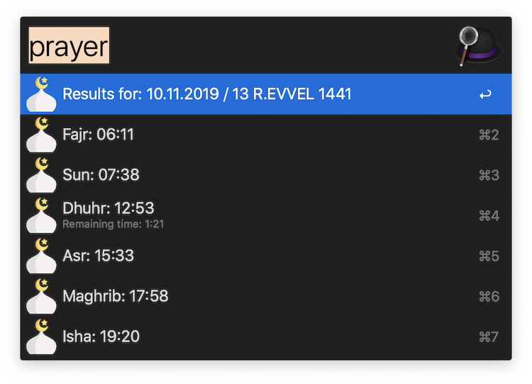
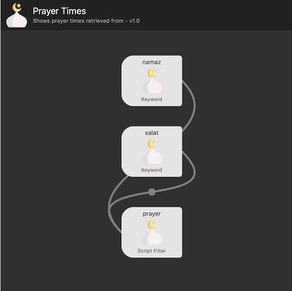

# Alfred-Prayer-Times

[**Download worklow here.**](https://raw.githubusercontent.com/imesut/alfred-prayer-times/master/PrayerTimes.alfredworkflow)

An [Alfred](https://www.alfredapp.com/) (Spotlight app for MacOS) workflow for displaying daily prayer times, data retrieved from [ezanvakti.herokuapp](https://ezanvakti.herokuapp.com) Ezanvakti retrieveds data from [Diyanet](https://namazvakitleri.diyanet.gov.tr/en-US)



This workflow caches data for one hour. It is possible to change this duration. [ezanvakti.herokuapp](https://ezanvakti.herokuapp.com) has an API call limit, caching time should be 45 seconds at least.

This workflow is tested with Alfred 3.

## Installation

1. Open file with .alfredworkflow extension. [**Download worklow here.**](https://raw.githubusercontent.com/imesut/alfred-prayer-times/master/PrayerTimes.alfredworkflow)
2. Install requirements file inside the workflow package. After adding workflow, right click to it then "Open in Finder". You can enter the directory and run ```pip3 install -r requirements.txt```

## Customization

1. Customize script filter: The placeId and localization code should be changed.

   1. Changind Place Id: Double click to the ```prayer```script filter box. The command will be like ```/usr/local/bin/python3 namaz.py 9541 en```
   1. Change **9541** value for place Id. This value can be obtained from [Prayer Times web site.](https://namazvakitleri.diyanet.gov.tr/en-US) When country / city and place details selected, the placeId will appear on the url like ```https://namazvakitleri.diyanet.gov.tr/en-US/cityId/...```

   1. Change local value **en**. This workflow currently contains **tr** and **en** codes. You can also add a new code by editing *localizations.py* file.
   
   1. Also you can change the Python3 path according to your system.

2. You can use multiple keywords like ```namaz```, ```prayer```, ```salat``` and more. To add new keywords use workflow screen. 


# Credits

- [ezanvakti.herokuapp](https://ezanvakti.herokuapp.com)

-  <div>Icons made by <a href="https://www.flaticon.com/authors/freepik" title="Freepik">Freepik</a> from <a href="https://www.flaticon.com/" title="Flaticon">www.flaticon.com</a></div>